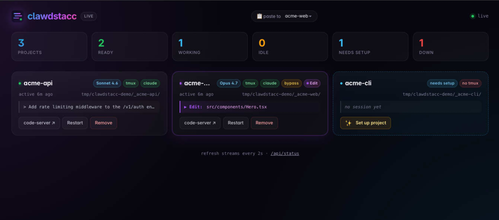
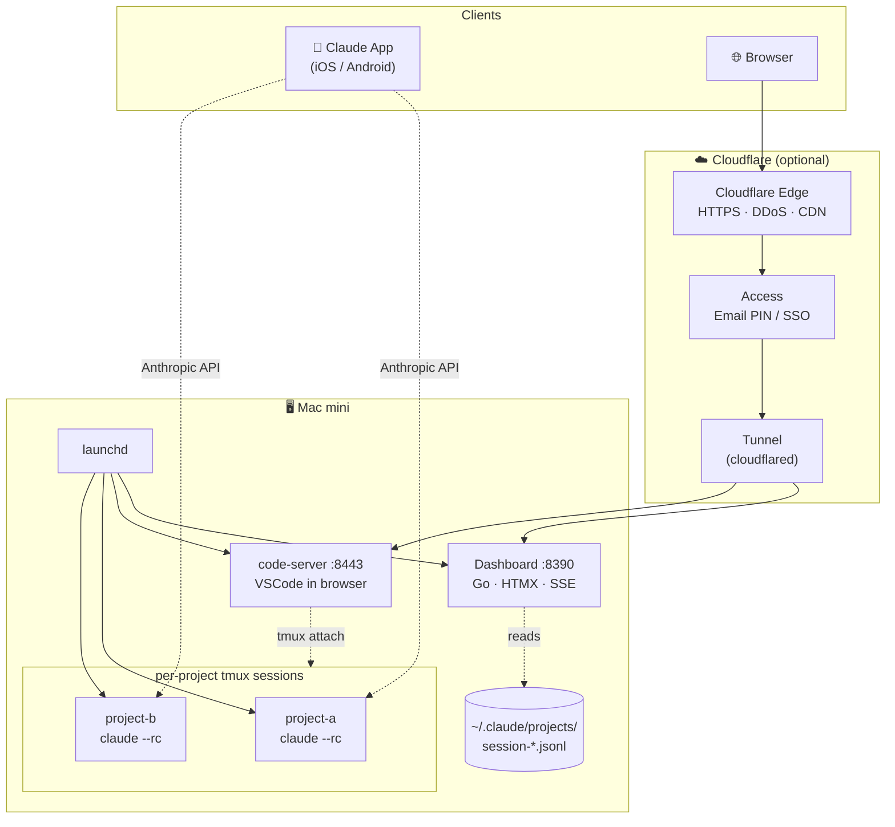

<div align="center">


# clawdstacc

**Self-hosted Codespaces for Claude Code, on your own Mac.**
Persistent agent sessions you reach from your phone, browser, and laptop —
all running natively under launchd, no containers, no VMs.

[](https://github.com/larskghf/clawdstacc/actions/workflows/ci.yml)
[](./LICENSE)
[](https://www.apple.com/mac/)
[](https://go.dev/)

</div>

---

<!-- Drop a real screenshot at docs/screenshot.png to make this hero image. -->
<p align="center">
  
  <br><i>Live status of every Claude Code session running on your host.</i>
</p>

## Why

Running [Claude Code](https://claude.com/code) headless on a Mac mini and reaching it from your phone shouldn't require a custom shell-script archipelago. Most "remote VS Code" stacks (Codespaces, gitpod, Coder) are great for cloud — but they don't let you keep a long-lived `claude --rc` session attached to your local repos, and they're not free.

**clawdstacc gives you exactly that:** every project gets its own tmux+claude session, supervised by `launchd`, watchable from a tiny live dashboard, accessible in the browser via [code-server](https://github.com/coder/code-server), and reachable from the Claude iOS/Android app as a Remote Control session. One Mac mini, all your agents.

## What you get

- 🟢 **Always-on agents.** Each project = one persistent `claude --rc` session. Survives reboots, network drops, browser tabs.
- 📱 **Phone-native.** Sessions show up directly in the [Claude app](https://claude.ai) — type prompts on the train, your Mac runs the tools.
- 🖥️ **Browser-native.** [code-server](https://github.com/coder/code-server) at one URL, the integrated terminal auto-attaches to the running session.
- 📊 **Live dashboard** with per-project status, last user message, current tool call, restart button. Server-rendered HTMX + Server-Sent-Events — no JS framework, no build step.
- 🔄 **Auto-discovery** — drop a new directory into your projects glob, the dashboard sees it instantly with a one-click *"Set up"* button.
- 📋 **Image-paste bridge** — paste screenshots straight into the dashboard (Cmd+V), they land as files and the path is injected into the chosen Claude session. (See [Pasting screenshots](#pasting-screenshots) for the why.)
- 🌐 **Public access** via [Cloudflare Tunnel](https://www.cloudflare.com/products/tunnel/) + [Access](https://www.cloudflare.com/products/zero-trust/zero-trust-network-access/) — no open ports, free TLS, OAuth/Email-PIN login.
- 🪶 **Headless mode** — skip code-server entirely if you only use the Claude app's Remote Control sessions. (See [Headless mode](#headless-mode-no-code-server).)
- 🪶 **Native, not containerised.** launchd manages everything; Claude has full filesystem and MCP access.

## Quickstart

```bash
# 1. Install — brew pulls in tmux + code-server automatically
brew tap larskghf/tap
brew install clawdstacc

# 2. Claude Code CLI (not on brew)
curl -fsSL https://claude.com/install.sh | bash

# 3. Config — copy the example and set CODESERVER_PASSWORD (or AUTH=none)
cp $(brew --prefix)/etc/clawdstacc/clawdstacc.conf.example ~/clawdstacc.conf
$EDITOR ~/clawdstacc.conf

# 4. Register launchd agents
clawdstacc setup --conf ~/clawdstacc.conf
```

Then open <http://localhost:8390> for the dashboard and <http://localhost:8443> for code-server.

### Install paths

| | When to use |
|---|---|
| **`brew install`** (above) | Recommended for everyone. Auto-deps, signed update path, no source clone. |
| **`bash <(curl … install.sh)`** | If you want the source tree locally (e.g. to hack on the dashboard). Clones repo to `~/clawdstacc`, builds the binary, generates `clawdstacc.conf` with a random `CODESERVER_PASSWORD`, runs setup. |
| **Manual** | Clone, `cp clawdstacc.conf.example clawdstacc.conf`, edit, `go build -o bin/clawdstacc ./cmd/clawdstacc && ./bin/clawdstacc setup`. |

**Headless** (skip code-server, only Remote Control sessions): set `ENABLE_CODESERVER="false"` in your conf. Or via the curl installer: `CLAWDSTACC_HEADLESS=1 bash <(curl …)`.

### Adding a project

Create a folder matching the `PROJECTS_GLOB` (default: any `~/_*` directory) and refresh the dashboard. The new card appears with a *"Set up"* button — click it once and you're done.

```bash
mkdir ~/_my-new-app
cd ~/_my-new-app
git init
# Refresh http://localhost:8390 → click "Set up"
```

## Architecture



Three plist types live in `~/Library/LaunchAgents/`:

- `com.user.clawdstacc.<name>.plist` — one per project, runs `tmux new-session "claude --rc"`
- `com.user.clawdstacc.codeserver.plist` — single instance, code-server on `~`
- `com.user.clawdstacc.dashboard.plist` — single instance, the Go status dashboard

All set `RunAtLoad: true` and `KeepAlive: true`. If a tmux session dies, launchd respawns the watcher script within ~10 seconds — and that script does `claude --continue`, so the conversation resumes mid-thought.

## Configuration

Edit `clawdstacc.conf`. Highlights:

| Key | Default | What it does |
|---|---|---|
| `PROJECTS_GLOB` | `$HOME/_*` | Which directories become managed projects |
| `ENABLE_CODESERVER` | `true` | Set to `false` for [headless mode](#headless-mode-no-code-server) |
| `CODESERVER_BIND` | `0.0.0.0:8443` | code-server bind address (ignored when `ENABLE_CODESERVER=false`) |
| `CODESERVER_AUTH` | `password` | `password` or `none` (use `none` behind an upstream auth layer like Cloudflare Access) |
| `CODESERVER_PASSWORD` | (generated) | Used when auth=password. Generate: `openssl rand -base64 24` |
| `CODESERVER_PUBLIC_URL` | (empty) | Public URL when proxied (e.g. `https://code.example.com`) — dashboard's "code-server ↗" links honour it |
| `DASHBOARD_PORT` | `8390` | Dashboard port |
| `LOG_DIR` | `$HOME/Library/Logs/clawdstacc` | Per-service log files |
| `CLAUDE_CONTINUE` | `true` | `claude --continue` on auto-start |
| `CLAUDE_EXTRA_FLAGS` | `""` | Extra flags for `claude` (e.g. `--dangerously-skip-permissions`) |
| `BREW_PREFIX` | `/opt/homebrew` | Apple Silicon. Set `/usr/local` for Intel |
| `EXPLICIT_PROJECTS` | (unset) | Bash array — overrides the glob if present |

After editing, re-run `./bin/clawdstacc setup` to apply (idempotent).

## Going public (Cloudflare Tunnel + Access)

clawdstacc is deliberately bind-on-`0.0.0.0` and **does not authenticate the dashboard itself**. Reaching it from outside your LAN means putting an auth proxy in front. The simplest free path is Cloudflare Tunnel + Access:

1. **Tunnel.** [`brew install cloudflared`](https://developers.cloudflare.com/cloudflare-one/connections/connect-networks/), authenticate, create a named tunnel, route `clawdstacc.example.com` → `http://localhost:8390` and `code.example.com` → `http://localhost:8443`.
2. **Access.** In Cloudflare Zero Trust, create one **Self-hosted application** per subdomain. Identity Provider: **One-Time PIN** (no external IdP needed — uses email magic codes). Add a policy "include emails: yours@example.com".
3. **Dashboard config.** Set `CODESERVER_PUBLIC_URL="https://code.example.com"` in `clawdstacc.conf` so "code-server ↗" links route via the public URL when the request comes over HTTPS, but stay LAN-direct otherwise.
4. **code-server auth.** Set `CODESERVER_AUTH="none"` so users only authenticate once (at Cloudflare Access) instead of twice.

WebSockets/SSE work through Cloudflare Tunnel out of the box — no extra config.

## Pasting screenshots

Text paste into the Claude session works fine through code-server's terminal — Cmd+V types your clipboard text into the tmux pane, Claude reads it as input. **Image paste does not.** Two reasons:

1. **xterm.js doesn't pass binary data through to the TTY.** The browser-side terminal only accepts text from `navigator.clipboard.readText()`. Image clipboard items are silently dropped — you'll see a brief "Pasting text…" flash with nothing arriving.
2. **Claude Code reads images from `pbpaste`/`osascript`** (the Mac's system clipboard), which means the image has to be on the *Mac mini's* clipboard — not your laptop's. Apple Universal Clipboard sometimes hides this gap; everywhere else, it doesn't.

The dashboard has a built-in bridge for this:

1. Pick a target project from the **`📋 paste to`** dropdown in the dashboard header (defaults to your most-recently-active session, persisted in `localStorage`).
2. Take a screenshot on your laptop.
3. **Cmd+V (or Ctrl+V) anywhere on the dashboard page.**
4. The image is uploaded to `/tmp/clawdstacc/<timestamp>.png` on the Mac mini and the absolute path is injected into the chosen tmux+claude pane via `tmux send-keys`. You see the path appear in Claude's prompt; press Enter and Claude reads the file.

The bridge uses the browser's `paste`-event (no `navigator.clipboard.read()`), so it works over plain HTTP without TLS. The selected card is highlighted with a green "PASTE TARGET" banner so you always know where the image is going. Pasted images are auto-deleted from `/tmp/clawdstacc/` after one hour.

## Headless mode (no code-server)

If you only ever talk to Claude via the iOS/Android Remote Control sessions and never use the in-browser IDE, you can skip code-server entirely:

```ini
# clawdstacc.conf
ENABLE_CODESERVER="false"
```

Or at install time:

```bash
CLAWDSTACC_HEADLESS=1 bash <(curl -fsSL .../install.sh)
```

What changes in headless mode:

- `code-server` is **not installed** by the installer (saves a brew install)
- The codeserver launchd plist is **not generated**
- Per-project `.vscode/{tasks,settings}.json` files are **not written**
- The dashboard hides the **"code-server ↗"** button on every card

The Claude Remote Control sessions and the dashboard remain fully functional. Switch back any time by setting `ENABLE_CODESERVER="true"` and re-running `./bin/clawdstacc setup`.

## Day-to-day

Everything is one binary. Subcommands:

```bash
# CLI status of every component (coloured table)
./bin/clawdstacc status

# Re-render plists after editing the config (idempotent)
./bin/clawdstacc setup

# Attach / list / kill clawdstacc tmux sessions (uses the dedicated socket)
./bin/clawdstacc tmux ls
./bin/clawdstacc tmux attach -t <project-name>

# Stop and remove a single project (keeps the project dir + Claude history)
./bin/clawdstacc remove <project-name>

# Stop and remove every launchd agent
./bin/clawdstacc teardown

# Run the dashboard in the foreground (default subcommand if you omit it)
./bin/clawdstacc dashboard --addr 127.0.0.1:8390

# Print version
./bin/clawdstacc version
```

Other useful one-liners:

```bash
# Restart one session manually
launchctl kickstart -k "gui/$(id -u)/com.user.clawdstacc.<projectname>"

# Tail every log at once
tail -f ~/Library/Logs/clawdstacc/*.log
```

If you want `clawdstacc` on `$PATH` globally:

```bash
ln -s ~/clawdstacc/bin/clawdstacc ~/.local/bin/clawdstacc
```

## Comparison

| | clawdstacc | code-server alone | Codespaces / gitpod | tmux + ssh |
|---|---|---|---|---|
| Always-on Claude `--rc` sessions | ✅ | ❌ | ❌ | manual |
| Dashboard with per-project status | ✅ | ❌ | partial | ❌ |
| Phone access (Claude app + Code tab) | ✅ | ❌ | ❌ | ❌ |
| Self-hosted, no per-seat fees | ✅ | ✅ | ❌ | ✅ |
| Auto-resumes after reboots / drops | ✅ (`--continue` + KeepAlive) | depends | ❌ | manual |
| MCP servers, full filesystem, native tools | ✅ | ✅ | restricted | ✅ |

## Development

```bash
git clone https://github.com/larskghf/clawdstacc.git
cd clawdstacc
cp clawdstacc.conf.example clawdstacc.conf
$EDITOR clawdstacc.conf

# Build + test
go vet ./...
go test ./...
go build -o bin/clawdstacc ./cmd/clawdstacc

# Apply changes live (rebuilds + reloads dashboard, leaves agents alone)
./bin/clawdstacc setup
launchctl kickstart -k "gui/$(id -u)/com.user.clawdstacc.dashboard"
```

### Repo layout

```
clawdstacc/
├── cmd/clawdstacc/         # entrypoint (5-line main, calls into internal/clawd)
├── internal/clawd/         # all the actual code
│   ├── cmd_*.go            # subcommand handlers (setup/teardown/status/dashboard/version)
│   ├── server.go           # HTTP routes, SSE, HTMX endpoints
│   ├── status.go           # CollectStatus, tmux/launchctl probing
│   ├── jsonl.go            # JSONL parser for session info
│   ├── setup.go            # SetupProject (per-project plist + .vscode rendering)
│   ├── config.go           # clawdstacc.conf parser
│   ├── paste.go            # /api/paste image-bridge endpoint
│   ├── templates_embed.go  # //go:embed templates
│   ├── *_test.go
│   ├── web/                # embedded dashboard HTML/CSS/JS (via go:embed)
│   └── templates/          # embedded launchd + VSCode templates (via go:embed)
├── docs/                   # SETUP.md, TROUBLESHOOTING.md, screenshot.png
├── install.sh              # curl-pipe-bash bootstrap
├── clawdstacc.conf.example
└── ...
```

The binary embeds **everything** via `go:embed` — HTML/CSS/JS, launchd plist
templates, VSCode configs. One binary, no asset paths to manage at runtime.

CI runs `go vet`, `gofmt -s`, `go test -race`, `go build`, plus `shellcheck`
on `install.sh`. PRs must be green.

## Contributing

Pull requests welcome — see [CONTRIBUTING.md](./CONTRIBUTING.md). Code of conduct in [CODE_OF_CONDUCT.md](./CODE_OF_CONDUCT.md). Security disclosures in [SECURITY.md](./SECURITY.md).

Particularly welcome:

- **Linux support** (`systemd` parallel to launchd; the templates already abstract well)
- **Notification webhooks** (Telegram/Discord/Slack on agent done / permission needed)
- **Mobile-first dashboard polish** (PWA-ready, swipe gestures)
- **More tests** — anything currently shelling out to tmux/launchctl is a candidate for refactoring with an interface

## Acknowledgements

Built on the shoulders of:

- [Claude Code](https://claude.com/code) (Anthropic)
- [tmux](https://github.com/tmux/tmux)
- [code-server](https://github.com/coder/code-server) (Coder)
- [HTMX](https://htmx.org)
- [Cloudflare Tunnel + Zero Trust Access](https://developers.cloudflare.com/cloudflare-one/)

## License

[MIT](./LICENSE) — do whatever, just don't blame us.
